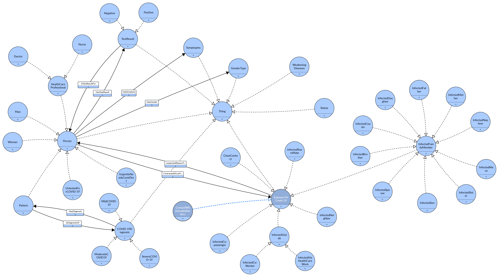

# Ontology: COVID-19 inspection : exposure, symptoms andweakening diseases
This is a classification project 
## Summary
For the past 10 months the world has been suffering from thisepidemic that is taking over so we decided for this project to putour focus on the problem that is shaking every one all around theglobe. In a world where the most valuable item is data we consid-ered making a classification considering the COVID-19 medicaland life facts to try and help enhance the protection and have abetter idea of how this virus is going viral.

## Editors:
- Olfa Ben Amar
- Mehdi Gannem
- [Sassi Ghaith](https://github.com/ghaithsassi)
## Ontology Graph
 
## Licence
See the [LICENSE](https://github.com/ghaithsassi/IA301-ONTOLOGY-SYMBOLIC_AI/blob/master/LICENSE.md) file for license rights and limitations (MIT).

